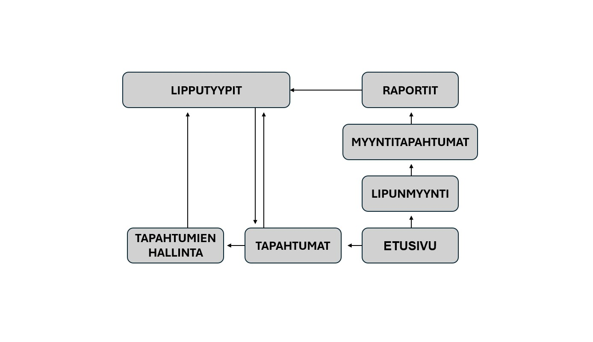
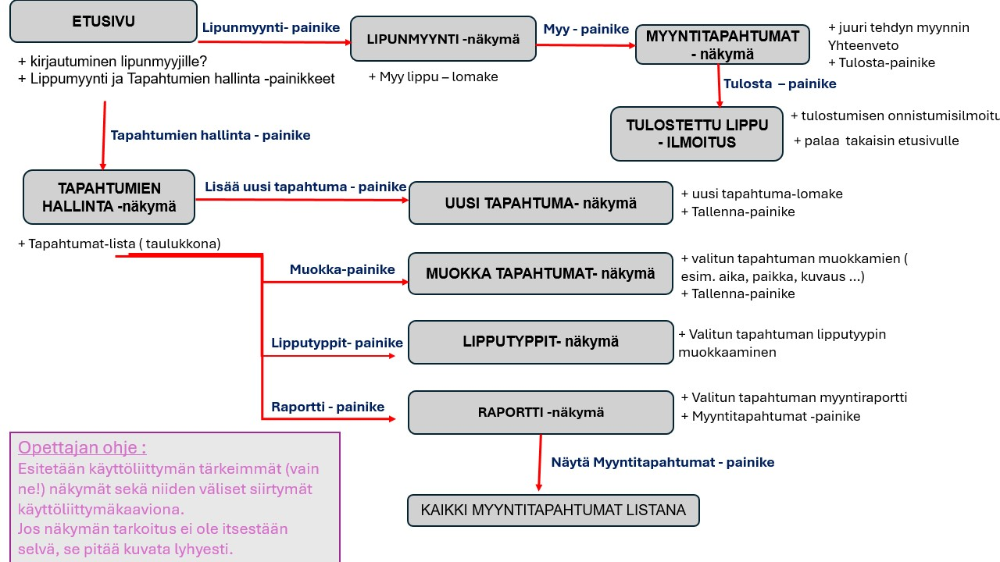
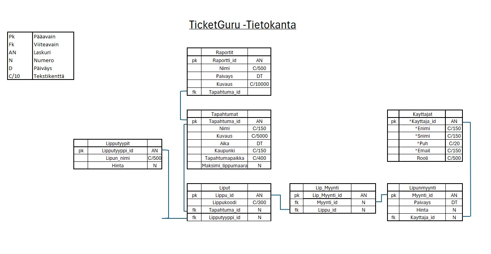

# TicketGuru
OK-Tiimi: Anniina, Erkka, Maria, Teppo, Thu, Ville

## Johdanto
Kehitettävä ohjelmisto on lippujenmyyntijärjestelmä, johon voi lisätä tapahtumia, määritellä niihin lipputyyppejä ja myydä lippuja tapahtumiin. Järjestelmä rekisteröi myös myytyjen lippujen tiedot tapahtumakohtaisesti. Järjestelmä kehitetään niin, että siihen voidaan jatkokehityksessä lisätä myös verkkokauppa, josta lipputoimiston asiakkaat voivat ostaa itse lippuja.
Asiakas on lipputoimisto, joka on tilannut lipunmyyntijärjestelmän myyntipisteeseensä. 
Projekti toteutetaan Scrum-mallin mukaisesti.

### Toteutus- ja toimintaympäristö
Ohjelmisto toteutetaan Javalla käyttäen Spring Boot -kehystä. 
Päätelaitteena on pääasiassa desktop, koska aluksi ohjelmaa käytetään vain lipunmyyntipisteessä. Jatkokehitystä varten ohjelmiston tulee olla laajennettavissa myös mobiilikäyttöön.

## Järjestelmän määrittely

### Käyttäjäryhmät

**Admin**
- tapahtumien tietojen muokkaaminen
- tapahtumien lippujen määrien muokkaaminen
- tapahtumien lipputyyppien muokkaaminen

**Lipunmyyjä**
- lippujen myyminen ja tulostaminen
- lippujen määrien ja hintojen tarkastelu

**Lipunostaja**

## Käyttäjätarinat
> **1.**
> Lipunmyyntitoimistona haluan myydä lippuja eri asiakasryhmille (esim. aikuiset ja lapset), jotta voin tarjota asiakkaille sopivat lippuvaihtoehdot ja hinnoittelun.

> **2.**
> Lipunmyyntitoimistona haluan luoda uuden tapahtuman järjestelmään (nimi, kuvaus, aika, paikka, kaupunki, lippujen määrä), jotta voin aloittaa lipunmyynnin ajoissa.

> **3.**
> Lipunmyyntitoimistona haluan tulostaa myydyn lipun, jotta voin antaa asiakkaalle fyysisen todisteen ostoksesta ja varmistaa pääsyn tapahtumaan.

>**4.**
> Lipunmyyntitoimistona haluan muokata tapahtumien tietoja (aika, paikka, kuvaus, kaupunki, lippujen määrä), jotta voin pitää tapahtumatiedot ajan tasalla ja varmistaa oikean tiedon asiakkaille.

>**5.** 
> Lipunmyyntitoimistona haluan tarkastella myyntiraportteja tapahtumakohtaisesti, jotta voin seurata lipunmyynnin kehitystä, kirjata myydyt lipputyypit ja niiden tuottamat tulot sekä tehdä parempia liiketoimintapäätöksiä.

>**5.** 
> Tapahtumanjärjestäjänä haluan luoda uuden tapahtuman järjestelmään (nimi, kuvaus, aika, paikka, kaupunki), jotta voin aloittaa lipunmyynnin ajoissa.

### Käyttöliittymä

## Käyttöliittymä

## Tietokantamalli

>>>>>>> 9635623 (Tietokanta)
