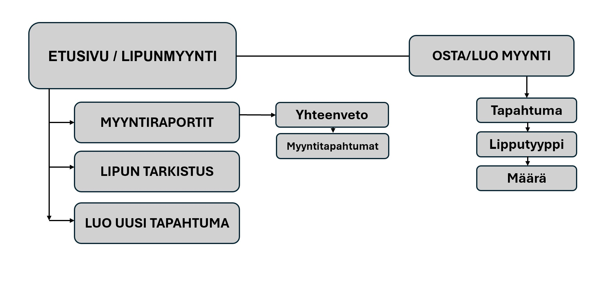
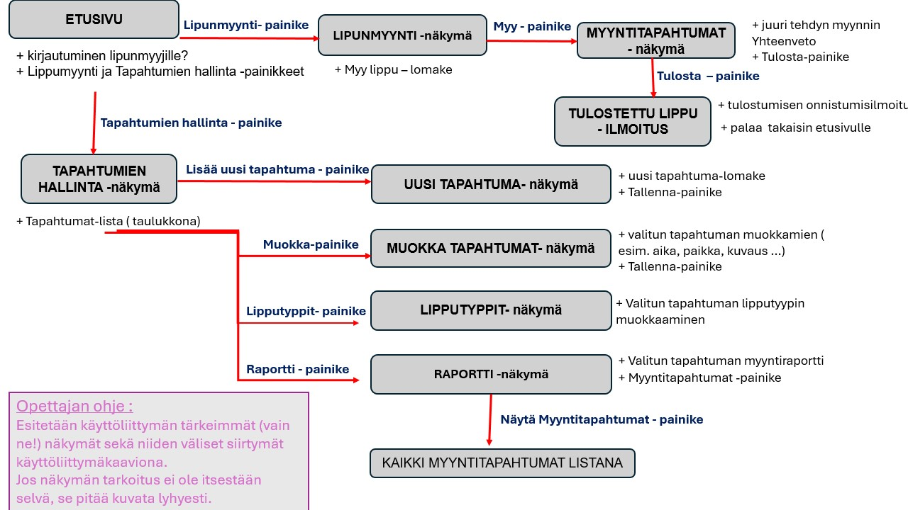
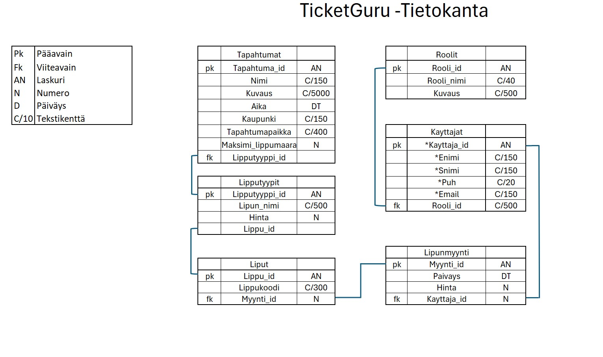
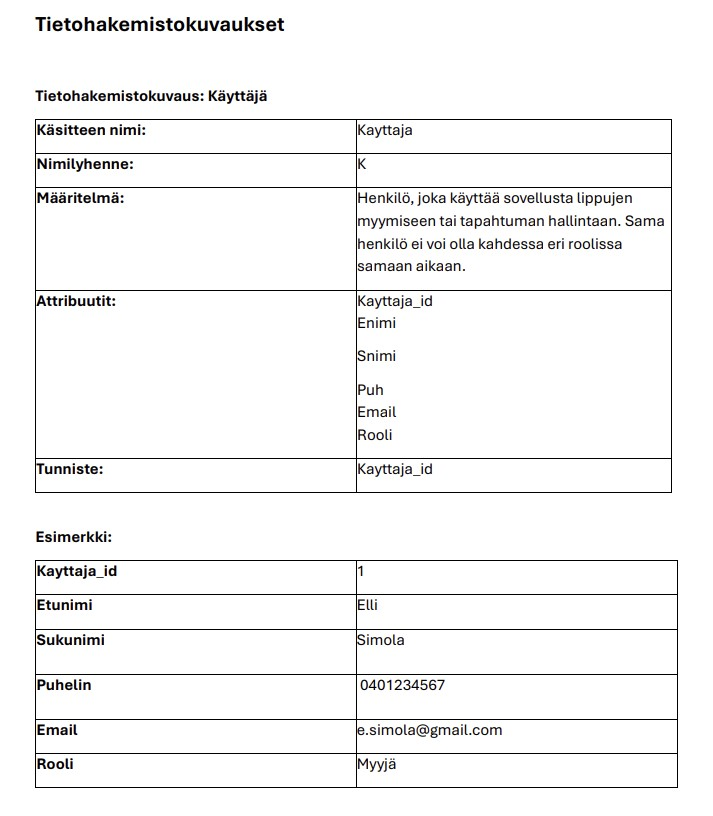
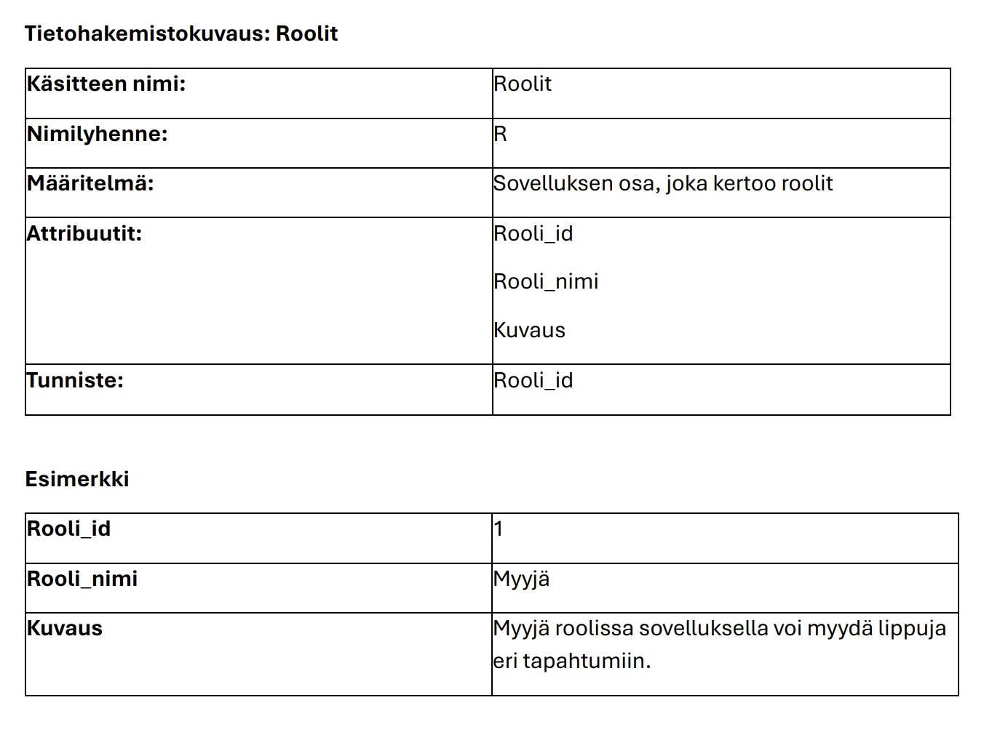
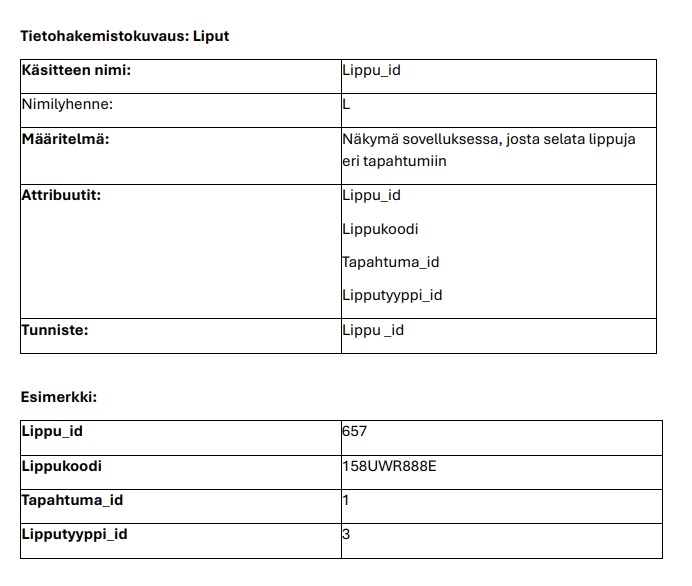
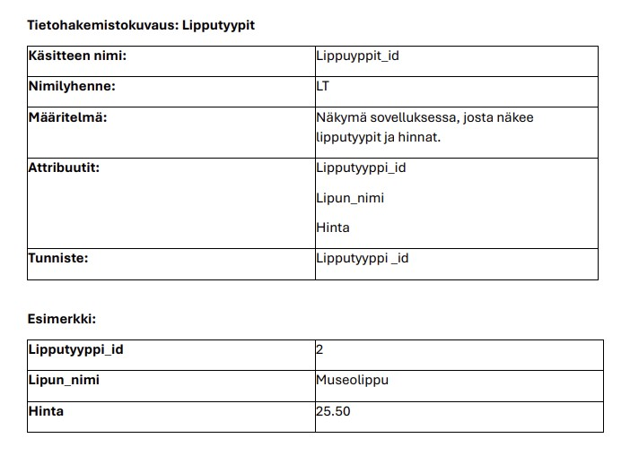
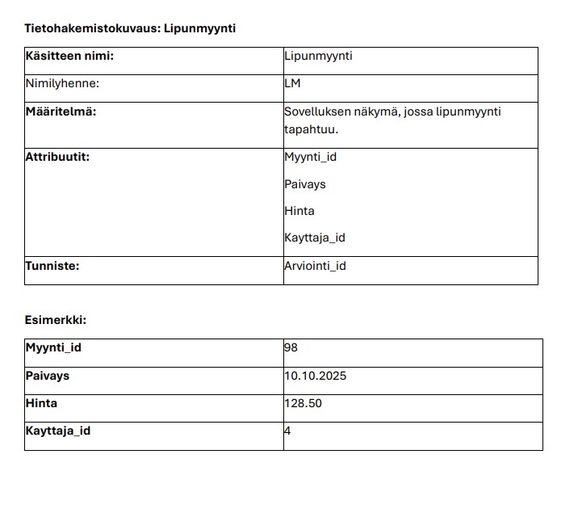
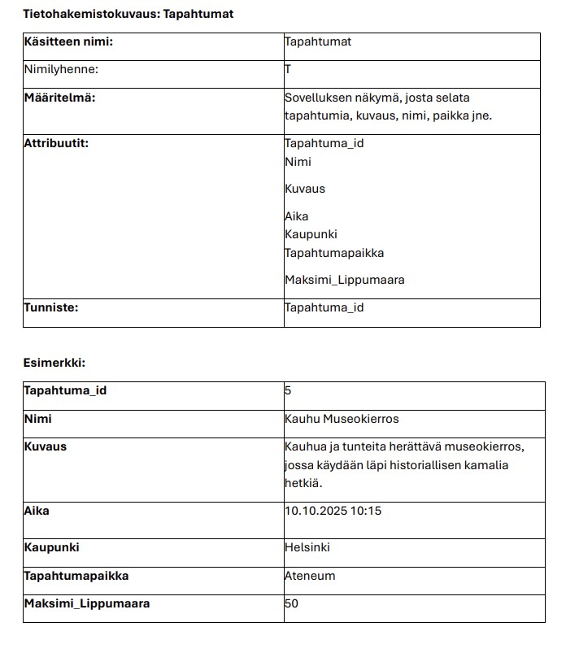

# TicketGuru
OK-Tiimi: Anniina, Erkka, Teppo, Thu, Ville

## Johdanto
Kehitettävä ohjelmisto on lippujenmyyntijärjestelmä, johon voi lisätä tapahtumia, määritellä niihin lipputyyppejä ja myydä lippuja tapahtumiin. Järjestelmä rekisteröi myös myytyjen lippujen tiedot tapahtumakohtaisesti. Järjestelmä kehitetään niin, että siihen voidaan jatkokehityksessä lisätä myös verkkokauppa, josta lipputoimiston asiakkaat voivat ostaa itse lippuja.
Asiakas on lipputoimisto, joka on tilannut lipunmyyntijärjestelmän myyntipisteeseensä. 
Projekti toteutetaan Scrum-mallin mukaisesti.

### Toteutus- ja toimintaympäristö
Ohjelmisto toteutetaan Javalla käyttäen Spring Boot -kehystä. 
Päätelaitteena on pääasiassa desktop, koska aluksi ohjelmaa käytetään vain lipunmyyntipisteessä. Jatkokehitystä varten ohjelmiston tulee olla laajennettavissa myös mobiilikäyttöön.

## Järjestelmän määrittely

### Käyttäjäryhmät

**Admin**
- tapahtumien tietojen muokkaaminen
- tapahtumien lippujen määrien muokkaaminen
- tapahtumien lipputyyppien muokkaaminen

**Lipunmyyjä**
- lippujen myyminen ja tulostaminen
- lippujen määrien ja hintojen tarkastelu

**Lipunostaja**

## Käyttäjätarinat
> **1.**
> Lipunmyyntitoimistona haluan myydä lippuja eri asiakasryhmille (esim. aikuiset ja lapset), jotta voin tarjota asiakkaille sopivat lippuvaihtoehdot ja hinnoittelun.

> **2.**
> Lipunmyyntitoimistona haluan luoda uuden tapahtuman järjestelmään (nimi, kuvaus, aika, paikka, kaupunki, lippujen määrä), jotta voin aloittaa lipunmyynnin ajoissa.

> **3.**
> Lipunmyyntitoimistona haluan tulostaa myydyn lipun, jotta voin antaa asiakkaalle fyysisen todisteen ostoksesta ja varmistaa pääsyn tapahtumaan.

>**4.**
> Lipunmyyntitoimistona haluan muokata tapahtumien tietoja (aika, paikka, kuvaus, kaupunki, lippujen määrä), jotta voin pitää tapahtumatiedot ajan tasalla ja varmistaa oikean tiedon asiakkaille.

>**5.** 
> Lipunmyyntitoimistona haluan tarkastella myyntiraportteja tapahtumakohtaisesti, jotta voin seurata lipunmyynnin kehitystä, kirjata myydyt lipputyypit ja niiden tuottamat tulot sekä tehdä parempia liiketoimintapäätöksiä.


>**6.** 
> Tapahtumanjärjestäjänä haluan luoda uuden tapahtuman järjestelmään (nimi, kuvaus, aika, paikka, kaupunki), jotta voin aloittaa lipunmyynnin ajoissa.


### Käyttöliittymä




## Tietokantamalli



## Tietohakemistokuvaukset









## API 
-----------------------------------

### ROOLIT API

#### Base-URL:
https://demo-ticketguru-oktiimi.2.rahtiapp.fi


#### Endpointit

**1. Hae kaikki roolit**

  - **Metodi**: GET

  - **URL**: https://demo-ticketguru-oktiimi.2.rahtiapp.fi/api/roles

  - **Vastaus: 200 OK**

```json
[
    {
        "roleId": 1,
        "roleName": "myyjä",
        "notes": null
    }
]
```
**2. Hae roolin ID:llä**
    
  - **Metodi**: GET

  - **URL**: https://demo-ticketguru-oktiimi.2.rahtiapp.fi/api/roles/{id}

  - **Parametrit**: id = roleId (Long)
  
  - **Vastaus: 200 OK**

```json

 {
    "roleId": 1,
    "roleName": "myyjä",
    "notes": null
}
```

  - **virhe**:
     - **404 Not Found**
  

**3. Luo uusi rooli**
    
  - **Metodi**: POST

  - **URL**: https://demo-ticketguru-oktiimi.2.rahtiapp.fi/api/roles

  - **Request Body (JSON)**: 

```json
{
        "roleName": "admin",
        "notes": "Responsible for system maintenance and myyjä-users"
    }
```
  - **Validointi**:
    
  | Kenttä        | Tyyppi         | Validointisäännöt                             |
  |---------------|----------------|-----------------------------------------------|
  | roleName      |String          | Pakollinen, ei saa olla tyhjä , max 50 merkkiä, uniikki   |
  | notes     | String             | Valinnainen, enintään 255 merkkiä               |
  
  - **Vastaus: 200 OK**

```json
  {
    "roleId": 2,
    "roleName": "admin",
    "notes": "Responsible for system maintenance and myyjä-users"
}
  ```
  - **virhe**:
     - **400 Bad request**

**4. Päivitä roolin tiedot ID:llä**
    
  - **Metodi**: PUT

  - **URL**: https://demo-ticketguru-oktiimi.2.rahtiapp.fi/api/roles/{id}

  - **Parametrit**: id = roleId (Long)

  - **Request Body (JSON)**: 

```json
{
        "roleName": "myyjä",
        "notes": "Full access to all ticket sales, no access to user management"
}

```
  -**Validointi**:

  | Kenttä        | Tyyppi         | Validointisäännöt                             |
  |---------------|----------------|-----------------------------------------------|
  | roleName      |String          | Pakollinen, ei saa olla tyhjä , max 50 merkkiä, uniikki   |
  | notes     | String             | Valinnainen, enintään 255 merkkiä               |


  - **Vastaus: 200 OK**

```json
  {
    "roleId": 1,
    "roleName": "myyjä",
    "notes": "Full access to all ticket sales, no access to user management"
}
  ```
  - **Virhe**: 
    - **404 Not Found**
    - **400 Bad Request** 

**5. Poista roolin ID:llä**

  - **Metodi**: DELETE

  - **URL**: https://demo-ticketguru-oktiimi.2.rahtiapp.fi/api/users/{id}

  - **Parametrit**: id = käyttäjän Id (Long)

  - **Vastaus: 204 No Content**

  - **Virhe**: 
    - **404 Not Found**

-----------------------------------

### KÄYTTÄJÄT API

#### Base-URL:
https://demo-ticketguru-oktiimi.2.rahtiapp.fi/api/users


#### Endpointit

**1. Hae kaikki käyttäjät**

  - **Metodi**: GET

  - **URL**: https://demo-ticketguru-oktiimi.2.rahtiapp.fi/api/users

  - **Vastaus: 200 OK**

```json
[
     {
        "id": 1,
        "firstname": "Oskari",
        "lastname": "Uninen",
        "email": "oskari.uninen@gmail.com",
        "phone": "12345678",
        "role": {
            "roleId": 1,
            "roleName": "myyjä",
            "notes": "Full access to all ticket sales, no access to user management"
        }
    },
    {
        "id": 2,
        "firstname": "Jaska",
        "lastname": "Jokunen",
        "email": "jaska.jokunen@hotmail.com",
        "phone": "87654321",
        "role": {
            "roleId": 1,
            "roleName": "myyjä",
            "notes": "Full access to all ticket sales, no access to user management"
        }
    }
]
```
**2. Hae käyttäjän ID:llä**
    
  - **Metodi**: GET

  - **URL**: https://demo-ticketguru-oktiimi.2.rahtiapp.fi/api/users/{id}

  - **Parametrit**: id = käyttäjän id (Long)
  
  - **Vastaus: 200 OK**

```json

 {
    "id": 1,
    "firstname": "Oskari",
    "lastname": "Uninen",
    "email": "oskari.uninen@gmail.com",
    "phone": "12345678",
    "role": {
        "roleId": 1,
        "roleName": "myyjä",
        "notes": "Full access to all ticket sales, no access to user management"
    }
}
```

  - **virhe**:
     - **404 Not Found**
  

**3. Luo uusi käyttäjä**
    
  - **Metodi**: POST

  - **URL**: https://demo-ticketguru-oktiimi.2.rahtiapp.fi/api/users

  - **Request Body (JSON)**: 

```json
{
    "firstname": "Joku",
    "lastname": "Jokainen",
    "email": "Joku.jokainen@gmail.com",
    "phone": "99887766",
    "role": {
        "roleId": 1
    }
}
```
  - **Validointi**:
    
  | Kenttä        | Tyyppi         | Validointisäännöt                             |
  |---------------|----------------|-----------------------------------------------|
  | firstname      |String          | Pakollinen, ei saa olla tyhjä                               |
  | lastname      | String         | Pakollinen, ei saa olla tyhjä                 |
  | email          | String        | Pakollinen, ei saa olla tyhjä, unikki, kelvollinen sähköposti        |
  | phone           |String          | Pakollinen, ei saa olla tyhjä, vähintään 6 merkkiä                               |
  | role      | Role        | Pakollinen, ei saa olla null               |

  - **Vastaus: 200 OK**

```json
  {
    "id": 3,
    "firstname": "Joku",
    "lastname": "Jokainen",
    "email": "Joku.jokainen@gmail.com",
    "phone": "99887766",
    "role": {
        "roleId": 1,
        "roleName": "myyjä",
        "notes": "Full access to all ticket sales, no access to user management"
    }
}
  ```
  - **virhe**:
     - **400 Bad request**

**4. Päivitä käyttäjän tiedot ID:llä**
    
  - **Metodi**: PUT

  - **URL**: https://demo-ticketguru-oktiimi.2.rahtiapp.fi/api/users/{id}

  - **Parametrit**: id = käyttäjän Id (Long)

  - **Request Body (JSON)**: 

```json
{
    "firstname": "Oskari",
    "lastname": "Uninen",
    "email": "oskari.uninen@gmail.com",
    "phone": "12345678",
    "role": {
        "roleId": 2,
    }
}

```
  -**Validointi**:

  | Kenttä        | Tyyppi         | Validointisäännöt                             |
  |---------------|----------------|-----------------------------------------------|
  | firstname      |String          | Pakollinen, ei saa olla tyhjä                               |
  | lastname      | String         | Pakollinen, ei saa olla tyhjä                 |
  | email          | String        | Pakollinen, ei saa olla tyhjä, unikki, kelvollinen sähköposti        |
  | phone           |String          | Pakollinen, ei saa olla tyhjä, vähintään 6 merkkiä                               |
  | role      | Role                | Pakollinen, ei saa olla null               |


  - **Vastaus: 200 OK**

```json
   {
    "id": 1,
    "firstname": "Oskari",
    "lastname": "Uninen",
    "email": "oskari.uninen@gmail.com",
    "phone": "12345678",
    "role": {
        "roleId": 2,
        "roleName": "admin",
        "notes": "Responsible for system maintenance and myyjä-users"
    }
}
  ```
  - **Virhe**: 
    - esim. **400 Bad Request** Role not found with id 3 

**5. Poista käyttäjän ID:llä**

  - **Metodi**: DELETE

  - **URL**: https://demo-ticketguru-oktiimi.2.rahtiapp.fi/api/users/{id}

  - **Parametrit**: id = käyttäjän Id (Long)

  - **Vastaus: 204 No Content**

  - **Virhe**: 
    - **404 Not Found**

-----------------------------------

### LIPUNTYYPIT API

#### Base-URL:
https://demo-ticketguru-oktiimi.2.rahtiapp.fi/api/ticketTypes


#### Endpointit

**1. Hae kaikki lipuntyypit**

  - **Metodi**: GET

  - **URL**: https://demo-ticketguru-oktiimi.2.rahtiapp.fi/api/tickettypes

  - **Vastaus: 200 OK**

```json
[
    {
        "ticketTypeId": 1,
        "ticketName": "Adult",
        "price": 30.0
    },
    {
        "ticketTypeId": 2,
        "ticketName": "Child",
        "price": 15.0
    },
    {
        "ticketTypeId": 3,
        "ticketName": "Senior",
        "price": 20.0
    }
]
```
**2. Hae lipuntyypin ID:llä**
    
  - **Metodi**: GET

  - **URL**: https://demo-ticketguru-oktiimi.2.rahtiapp.fi/api/tickettypes/{id}

  - **Parametrit**: id = ticketTypeId (Long)
  
  - **Vastaus: 200 OK**

```json

 {
    "ticketTypeId": 1,
    "ticketName": "Adult",
    "price": 30.0
}
```

  - **virhe**:
     - **404 Not Found**
  

**3. Luo uusi lipuntyyppi**
    
  - **Metodi**: POST

  - **URL**: https://demo-ticketguru-oktiimi.2.rahtiapp.fi/api/tickettypes

  - **Request Body (JSON)**: 

```json
 {
        "ticketName": "student",
        "price": 15.0
    }
```
  - **Validointi**:
    
  | Kenttä        | Tyyppi         | Validointisäännöt                             |
  |---------------|----------------|-----------------------------------------------|
  | ticketTypeId   | Long           | autogeneroitu                                 |
  | ticketName     | String         | Pakollinen, ei saa olla tyhjä                 |
  | price           | Double         | Pakollinen, ei saa olla null ja >= 0         |

  - **Vastaus: 200 OK**

```json
  {
        "ticketTypeId": 4,
        "ticketName": "student",
        "price": 15.0
    }
  ```
  - **virhe**:
     - esim. **400 Bad request**

**4. Päivitä lipuntyypin ID:llä**
    
  - **Metodi**: PUT

  - **URL**: https://demo-ticketguru-oktiimi.2.rahtiapp.fi/api/tickettypes/{id}

  - **Parametrit**: id = ticketTypeId (Long)

  - **Request Body (JSON)**: 

```json
{
        "ticketName": "Student",
        "price": 10.0
    }

```
  -**Validointi**:

  | Kenttä        | Tyyppi         | Validointisäännöt                             |
  |---------------|----------------|-----------------------------------------------|
  | ticketTypeId   | Long           | autogeneroitu                                 |
  | ticketName     | String         | Pakollinen, ei saa olla tyhjä                 |
  | price           | Double         | Pakollinen, ei saa olla null ja >= 0         |

  - **Vastaus: 200 OK**

```json
   {
    "ticketTypeId": 4,
    "ticketName": "Student",
    "price": 10.0
}
  ```
  - **Virhe**: 
    - **400 Bad Request** 

**5. Poista lipuntyypin ID:llä**

  - **Metodi**: DELETE

  - **URL**: https://demo-ticketguru-oktiimi.2.rahtiapp.fi/api/tickettypes/{id}

  - **Parametrit**: id = ticketTypeId (Long)

  - **Vastaus: 204 No Content**

  - **Virhe**: 
    - **404 Not Found**


-----------------------------------------------

### TAPAHTUMAT API

#### Base-URL:
http://localhost:8080/api/events

#### Huomio päivämärästä:

- Päivämäärä**: YYYY-MM-DD (esim. "2025-10-05")

- Päivämäärä ja aika**: YYYY-MM-DDTHH:MM:SS (esim. "2025-10-10T18:00:00")

#### Endpointit

**1. Hae kaikki tapahtumat**

  - **Metodi**: GET

  - **URL**: https://demo-ticketguru-oktiimi.2.rahtiapp.fi/api/events

  - **Vastaus: 200 OK**

```json
[
  {
    "eventId": 1,
    "eventName": "Rock Concert",
    "eventLocation": "Arena A",
    "eventCity": "Helsinki",
    "eventDate": "2025-10-05",
    "eventDescription": "Live concert",
    "maxNumberOfTickets": 500
  },
   {
        "eventId": 2,
        "eventName": "Jazz Sunday",
        "eventLocation": "Jazz Club",
        "eventCity": "Tampere",
        "eventDate": "2025-11-02",
        "eventDescription": "Smooth jazz evening",
        "maxNumberOfTickets": 150
    },
]
```
**2. Hae tapahtuma ID:llä**
    
  - **Metodi**: GET

  - **URL**: https://demo-ticketguru-oktiimi.2.rahtiapp.fi/api/events/{id}

  - **Parametrit**: id = tapahtuman Id (Long)

  - **Vastaus: 200 OK**

```json
{
  "eventId": 1,
  "eventName": "Rock Night",
  "eventLocation": "Arena",
  "eventCity": "Helsinki",
  "eventDate": "2025-10-05",
  "eventDescription": "Live rock music",
  "maxNumberOfTickets": 500
}
```
  - **Virhe**: 
    - 404 Not Found 

**3. Luo uusi tapahtuma**
    
  - **Metodi**: POST

  - **URL**: https://demo-ticketguru-oktiimi.2.rahtiapp.fi/api/events

  - **Request Body (JSON)**: 

```json
  {
    "eventName": "Lapsimessu",
    "eventLocation": "Messukeskus",
    "eventCity": "Helsinki",
    "eventDate": "2025-10-30",
    "eventDescription": "Child fair",
    "maxNumberOfTickets": 1000
}

```
  - **Validointi**:
      | Kenttä              | Tyyppi     | Validointisäännöt |
      |----------------------|------------|-------------------|
      | eventName            | String     | Pakollinen, 2–100 merkkiä |
      | eventLocation        | String     | Pakollinen |
      | eventCity            | String     | Pakollinen |
      | eventDate            | LocalDate  | Täytyy olla tänään tai tulevaisuudessa |
      | eventDescription     | String     | Enintään 500 merkkiä |
      | maxNumberOfTickets   | Integer    | Vähintään arvo 1 |

  - **Vastaus**: **200 OK**

```json
   {
    "eventId": 4,
    "eventName": "Lapsimessu",
    "eventLocation": "messukeskus",
    "eventCity": "Helsinki",
    "eventDate": "2025-10-30",
    "eventDescription": "Child fair",
    "maxNumberOfTickets": 1000
  }   

  ```
  - **Virhe**

    - **400 Bad Request** ( jos validointisääntöjä on rikottu )


**4. Päivitä tapahtuma ID:llä**
    
  - **Metodi**: PUT

  - **URL**: https://demo-ticketguru-oktiimi.2.rahtiapp.fi/api/events/{id}

  - **Parametrit**: id = tapahtuman Id (Long)

  - **Request Body (JSON)**: 

```json
  {
    "eventName": "Rock Night",
    "eventLocation": "Päivitetty uusi arena",
    "eventCity": "Helsinki",
    "eventDate": "2025-10-31",
    "eventDescription": "Live rock music",
    "maxNumberOfTickets": 500
}

```

   - **Validointi**:
      | Kenttä              | Tyyppi     | Validointisäännöt |
      |----------------------|------------|-------------------|
      | eventName            | String     | Pakollinen, 2–100 merkkiä |
      | eventLocation        | String     | Pakollinen |
      | eventCity            | String     | Pakollinen |
      | eventDate            | LocalDate  | Täytyy olla tänään tai tulevaisuudessa |
      | eventDescription     | String     | Enintään 500 merkkiä |
      | maxNumberOfTickets   | Integer    | Vähintään arvo 1 |

  - **Vastaus**: 200 OK

  - **Virhe**: 
      - **404 Not Found**
      - **400 Bad Request** ( jos validointisääntöjä on rikottu )

**5. Poista tapahtuma ID:llä**

  - **Metodi**: DELETE

  - **URL**: https://demo-ticketguru-oktiimi.2.rahtiapp.fi/events/api/{id}

  - **Parametri**: id = tapahtuman Id (Long)

  - **Vastaus: 204 No Content**

  - **Virhe:**
    - **404 Not Found** 


-----------------------------------

### LIPUNMYYNTI API

#### Base-URL:
https://demo-ticketguru-oktiimi.2.rahtiapp.fi/api/ticketsales

#### Huomio päivämärästä:

- Päivämäärä: YYYY-MM-DD (esim. "2025-10-05")

- Päivämäärä ja aika: YYYY-MM-DDTHH:MM:SS (esim. "2025-10-10T18:00:00")

#### Endpointit

**1. Hae kaikki lipunmynnit**

  - **Metodi**: GET

  - **URL**: https://demo-ticketguru-oktiimi.2.rahtiapp.fi/api/ticketsales

  - **Vastaus: 200 OK**

```json
[
     {
        "saleId": 1,
        "dateTime": "2025-10-07T20:56:29.347646",
        "price": 60.00,
        "user": {
            "id": 1,
            "firstname": "Oskari",
            "lastname": "Uninen",
            "email": "oskari.uninen@gmail.com",
            "phone": "12345678",
            "role": {
                "roleId": 1,
                "roleName": "myyjä",
                "notes": "Full access to all ticket sales, no access to user management"
            }
        },
        "tickets": [
            {
                "ticketId": 1,
                "ticketCode": 1001,
                "ticketTypeId": {
                    "ticketTypeId": 3,
                    "ticketName": "Senior",
                    "price": 20.0
                },
                "eventId": {
                    "eventId": 1,
                    "eventName": "Rock Night",
                    "eventLocation": "Päivitetty uusi arena",
                    "eventCity": "Helsinki",
                    "eventDate": "2025-10-31",
                    "eventDescription": "Live rock music",
                    "maxNumberOfTickets": 500
                }
            },
            {
                "ticketId": 2,
                "ticketCode": 1002,
                "ticketTypeId": {
                    "ticketTypeId": 1,
                    "ticketName": "Adult",
                    "price": 30.0
                },
                "eventId": {
                    "eventId": 1,
                    "eventName": "Rock Night",
                    "eventLocation": "Päivitetty uusi arena",
                    "eventCity": "Helsinki",
                    "eventDate": "2025-10-31",
                    "eventDescription": "Live rock music",
                    "maxNumberOfTickets": 500
                }
            }
        ]
    }
]
```
**2. Hae lipunmyynti ID:llä**
    
  - **Metodi**: GET

  - **URL**: https://demo-ticketguru-oktiimi.2.rahtiapp.fi/ticketsales/api/{id}

  - **Parametrit**: id = saleId (Long)
  
  - **Vastaus: 200 OK**

```json

 {
        "saleId": 1,
        "dateTime": "2025-10-07T20:56:29.347646",
        "price": 60.00,
        "user": {
            "id": 1,
            "firstname": "Oskari",
            "lastname": "Uninen",
            "email": "oskari.uninen@gmail.com",
            "phone": "12345678",
            "role": {
                "roleId": 1,
                "roleName": "myyjä",
                "notes": "Full access to all ticket sales, no access to user management"
            }
        },
        "tickets": [
            {
                "ticketId": 1,
                "ticketCode": 1001,
                "ticketTypeId": {
                    "ticketTypeId": 3,
                    "ticketName": "Senior",
                    "price": 20.0
                },
                "eventId": {
                    "eventId": 1,
                    "eventName": "Rock Night",
                    "eventLocation": "Päivitetty uusi arena",
                    "eventCity": "Helsinki",
                    "eventDate": "2025-10-31",
                    "eventDescription": "Live rock music",
                    "maxNumberOfTickets": 500
                }
            },
            {
                "ticketId": 2,
                "ticketCode": 1002,
                "ticketTypeId": {
                    "ticketTypeId": 1,
                    "ticketName": "Adult",
                    "price": 30.0
                },
                "eventId": {
                    "eventId": 1,
                    "eventName": "Rock Night",
                    "eventLocation": "Päivitetty uusi arena",
                    "eventCity": "Helsinki",
                    "eventDate": "2025-10-31",
                    "eventDescription": "Live rock music",
                    "maxNumberOfTickets": 500
                }
            }
        ]
    }
{
    "saleId": 1,
    "dateTime": "2025-10-10T18:00:00",
    "price": 60.00,
    "user": {
        "id": 1,
        "firstname": "Demo1",
        "lastname": "User1",
        "email": "demo1@example.com",
        "phone": "12345678",
        "role": {
            "roleId": 1,
            "roleName": "myyjä",
            "notes": null
        }
    }
}

```
  - **Virhe**: 
    - **404 Not Found**

**3. Luo uusi lipunmyynti**
    
  - **Metodi**: POST

  - **URL**: https://demo-ticketguru-oktiimi.2.rahtiapp.fi/ticketsales/api

  - **Request Body (JSON)**: 

```json
  {
  "dateTime": "2025-10-15T14:00:00",
  "price": 60.0,
  "user": { "id": 2 },
  "tickets": [
    {
      "ticketCode": 1001,
      "ticketTypeId": { "ticketTypeId": 1 },
      "eventId": { "eventId": 2 }
    },
    {
      "ticketCode": 1222,
      "ticketTypeId": { "ticketTypeId": 1 },
      "eventId": { "eventId": 2 }
    }
  ]
}
```
  - **Validointi**:
    
  | Kenttä        | Tyyppi         | Validointisäännöt                             |
  |---------------|----------------|-----------------------------------------------|
  | dateTime      | LocalDateTime  | Pakollinen, ei saa olla null                  |
  | price         | BigDecimal     | Pakollinen, ≥ 0, ≤ 999,999.99, max 2 desimaalia |
  | user          | AppUser        | Pakollinen, ei saa olla null                  |
  | tickets       | List<Ticket>   | Pakollinen, ei voi olla tyhjä                   |
  | ticketCode    | Integer        | Valinnainen, generoidaan automaattisesti jos puuttuu|
  | ticketTypeId  | TicketType     | Pakollinen, pitää olla olemassa               |
  | eventId       | Event          | Pakollinen, pitää olla olemassa               |

   
  - **Vastaus: 200 OK**

```json
  {
    "saleId": 3,
    "dateTime": "2025-10-15T14:00:00",
    "price": 60.0,
    "user": {
        "id": 2,
        "firstname": "Jaska",
        "lastname": "Jokunen",
        "email": "jaska.jokunen@hotmail.com",
        "phone": "87654321",
        "role": {
            "roleId": 1,
            "roleName": "myyjä",
            "notes": null
        }
    },
    "tickets": [
        {
            "ticketId": 5,
            "ticketCode": 1001,
            "ticketTypeId": {
                "ticketTypeId": 1,
                "ticketName": "Adult",
                "price": 30.0
            },
            "eventId": {
                "eventId": 2,
                "eventName": "Jazz Sunday",
                "eventLocation": "Jazz Club",
                "eventCity": "Tampere",
                "eventDate": "2025-11-02",
                "eventDescription": "Smooth jazz evening",
                "maxNumberOfTickets": 150
            }
        },
        {
            "ticketId": 6,
            "ticketCode": 1222,
            "ticketTypeId": {
                "ticketTypeId": 1,
                "ticketName": "Adult",
                "price": 30.0
            },
            "eventId": {
                "eventId": 2,
                "eventName": "Jazz Sunday",
                "eventLocation": "Jazz Club",
                "eventCity": "Tampere",
                "eventDate": "2025-11-02",
                "eventDescription": "Smooth jazz evening",
                "maxNumberOfTickets": 150
            }
        }
    ]
}
  ```
  - **Virhe**: 

    - esim. **400 Bad Request** "TicketType not found"

**4. Päivitä lipunmyynti ID:llä**
    
  - **Metodi**: PUT

  - **URL**: https://demo-ticketguru-oktiimi.2.rahtiapp.fi/ticketsales/api/{id}

  - **Parametrit**: id = tapahtuman Id (Long)

  - **Request Body (JSON)**: 

```json
 {
  "user": { "id": 2 }, // uusi käyttäjä
  "dateTime": "2025-10-15T12:30:00",
  "price": 60.0
}

```
  - **Validointi**:
    
  | Kenttä        | Tyyppi         | Validointisäännöt                             |
  |---------------|----------------|-----------------------------------------------|
  | dateTime      | LocalDateTime  | Pakollinen, ei saa olla null                  |
  | price         | BigDecimal     | Pakollinen, ≥ 0, ≤ 999,999.99, max 2 desimaalia |
  | user          | AppUser        | Pakollinen, ei saa olla null                  |
  | tickets       | List<Ticket>   | Pakollinen, ei voi olla tyhjä                   |
  | ticketCode    | Integer        | Valinnainen, generoidaan automaattisesti jos puuttuu|
  | ticketTypeId  | TicketType     | Pakollinen, pitää olla olemassa               |
  | eventId       | Event          | Pakollinen, pitää olla olemassa               |

  - **Vastaus: 200 OK**

```json
   {
    "saleId": 1,
    "dateTime": "2025-10-15T12:30:00",
    "price": 60.0,
    "user": {
        "id": 2,
        "firstname": "Jaska",
        "lastname": "Jokunen",
        "email": "jaska.jokunen@hotmail.com",
        "phone": "87654321",
        "role": {
            "roleId": 1,
            "roleName": "myyjä",
            "notes": null
        }
    },
    "tickets": [
        {
            "ticketId": 1,
            "ticketCode": 1001,
            "ticketTypeId": {
                "ticketTypeId": 1,
                "ticketName": "Adult",
                "price": 30.0
            },
            "eventId": {
                "eventId": 1,
                "eventName": "Rock Night",
                "eventLocation": "Arena",
                "eventCity": "Helsinki",
                "eventDate": "2025-10-10",
                "eventDescription": "Live rock music",
                "maxNumberOfTickets": 500
            }
        },
        {
            "ticketId": 2,
            "ticketCode": 1002,
            "ticketTypeId": {
                "ticketTypeId": 1,
                "ticketName": "Adult",
                "price": 30.0
            },
            "eventId": {
                "eventId": 1,
                "eventName": "Rock Night",
                "eventLocation": "Arena",
                "eventCity": "Helsinki",
                "eventDate": "2025-10-10",
                "eventDescription": "Live rock music",
                "maxNumberOfTickets": 500
            }
        }
    ]
}

  ```
  - **Virhe**: 
    - esim. **400 Bad Request** Uset not found

**5. Poista lipunmyynnin ID:llä**

  - **Metodi**: DELETE

  - **URL**: https://demo-ticketguru-oktiimi.2.rahtiapp.fi/ticketsales/api/{id}

  - **Parametrit**: id = saleId (Long)

  - **Vastaus: 204 No Content**

  - **Virhe**: 
    - **404 Not Found**

-----------------------------------

### LIPUT API

#### Base-URL:
https://demo-ticketguru-oktiimi.2.rahtiapp.fi/api/tickets


#### Endpointit

**1. Hae kaikki myydyt liput**

  - **Metodi**: GET

  - **URL**: https://demo-ticketguru-oktiimi.2.rahtiapp.fi/api/tickets

  - **Vastaus: 200 OK**

```json
[
     {
        "ticketId": 1,
        "ticketCode": 1001,
        "ticketTypeId": {
            "ticketTypeId": 3,
            "ticketName": "Senior",
            "price": 20.0
        },
        "eventId": {
            "eventId": 1,
            "eventName": "Rock Night",
            "eventLocation": "Päivitetty uusi arena",
            "eventCity": "Helsinki",
            "eventDate": "2025-10-31",
            "eventDescription": "Live rock music",
            "maxNumberOfTickets": 500
        }
    },
    {
        "ticketId": 2,
        "ticketCode": 1002,
        "ticketTypeId": {
            "ticketTypeId": 1,
            "ticketName": "Adult",
            "price": 30.0
        },
        "eventId": {
            "eventId": 1,
            "eventName": "Rock Night",
            "eventLocation": "Päivitetty uusi arena",
            "eventCity": "Helsinki",
            "eventDate": "2025-10-31",
            "eventDescription": "Live rock music",
            "maxNumberOfTickets": 500
        }
    }
]
```
**2. Hae myydyn lipun ID:llä**
    
  - **Metodi**: GET

  - **URL**: https://demo-ticketguru-oktiimi.2.rahtiapp.fi/api/tickets/{id}

  - **Parametrit**: id = ticketId (Long)
  
  - **Vastaus: 200 OK**

```json

 {
    "ticketId": 1,
    "ticketCode": 1001,
    "ticketTypeId": {
        "ticketTypeId": 1,
        "ticketName": "Adult",
        "price": 30.0
    },
    "eventId": {
        "eventId": 1,
        "eventName": "Rock Night",
        "eventLocation": "Päivitetty uusi arena",
        "eventCity": "Helsinki",
        "eventDate": "2025-10-31",
        "eventDescription": "Live rock music",
        "maxNumberOfTickets": 500
    }
}
```
  - **Virhe**: 

    - **null**

**3. Etsi lippu ticketCodella**
  - **URL**: api/tickets/check?ticketCode={ticketCode}
  - **Vastaus** 200 OK
  - **Virhe** 404 Not Found

**. Merkitse lippu käytetyksi**
  - **URL**: /api/tickets/use?ticketCode={ticketCode} 

**4. Luo uusi myyty lippu**
    
  - **Metodi**: POST

  - **URL**: https://demo-ticketguru-oktiimi.2.rahtiapp.fi/api/tickets

  - **Request Body (JSON)**: 

```json
  {
  "ticketCode": "1015",
  "ticketTypeId": {
    "ticketTypeId": 3
  },
  "eventId": {
    "eventId": 2
  }
}
```
  - **Validointi**:
    
  | Kenttä        | Tyyppi         | Validointisäännöt                             |
  |---------------|----------------|-----------------------------------------------|
  | ticketCode    | Long           | Valinnainen, generoidaan automaattisesti jos puuttuu|
  | ticketTypeId  | TicketType     | Pakollinen, pitää olla olemassa               |
  | eventId       | Event          | Pakollinen, pitää olla olemassa               |

  - **Vastaus: 200 OK**

```json
  {
    "ticketId": 5,
    "ticketCode": 1015,
    "ticketTypeId": {
        "ticketTypeId": 3,
        "ticketName": "Senior",
        "price": 20.0
    },
    "eventId": {
        "eventId": 2,
        "eventName": "Jazz Sunday",
        "eventLocation": "Jazz Club",
        "eventCity": "Tampere",
        "eventDate": "2025-11-02",
        "eventDescription": "Smooth jazz evening",
        "maxNumberOfTickets": 150
    }
}
  ```
  - **virhe**:
     - esim. **400 Bad request** TicketType not found

**5. Päivitä myydyn lipun ID:llä**
    
  - **Metodi**: PUT

  - **URL**: https://demo-ticketguru-oktiimi.2.rahtiapp.fi/api/tickets/{id}

  - **Parametrit**: id = ticketId (Long)

  - **Request Body (JSON)**: 

```json
 {              
  "ticketTypeId": { "ticketTypeId": 3 }, 
  "eventId": { "eventId": 1 }           
}

```
  -**Validointi**:

  | Kenttä        | Tyyppi         | Validointisäännöt                             |
  |---------------|----------------|-----------------------------------------------|
  | ticketCode    | Long           | Valinnainen, generoidaan automaattisesti jos puuttuu|
  | ticketTypeId  | TicketType     | Pakollinen, pitää olla olemassa               |
  | eventId       | Event          | Pakollinen, pitää olla olemassa               |
  - **Vastaus: 200 OK**

```json
   {
    "ticketId": 1,
    "ticketCode": 1001,
    "ticketTypeId": {
        "ticketTypeId": 3,
        "ticketName": "Senior",
        "price": 20.0
    },
    "eventId": {
        "eventId": 1,
        "eventName": "Rock Night",
        "eventLocation": "Päivitetty uusi arena",
        "eventCity": "Helsinki",
        "eventDate": "2025-10-31",
        "eventDescription": "Live rock music",
        "maxNumberOfTickets": 500
    }
}
  ```
  - **Virhe**: 
    - esim. **400 Bad Request** Event not found

**6. Poista myydyn lipun ID:llä**

  - **Metodi**: DELETE

  - **URL**: https://demo-ticketguru-oktiimi.2.rahtiapp.fi/api/tickets/{id}

  - **Parametrit**: id = ticketId (Long)

  - **Vastaus: 204 No Content**

  - **Virhe**: 
    - **404 Not Found**
   


**8. Merkitse lippu käytetyksi**
  - **URL**: /api/tickets/use?ticketCode={ticketCode} 


## Turvallisuusratkaisu

--------------------------------------

- Sovelluksen tietoturva on toteutettu **Spring Security -kirjastolla (WebSecurityConfig)**.

- Käytössä on **HTTP Basic -autentikointi**, jossa käyttäjät tunnistautuvat **käyttäjätunnuksella ja salasanalla**.

- Salasanat turvallisesti **BCryptPasswordEncoder**:lla.

- Kaikki API-endpointit vaativat **autentikoinnin**.

- **Käyttöoikeudet** määritellään käyttäjäroolien mukaan:

    - **Admin**: käyttäjä, jolla on täydet oikeudet.

    - **Myyjä**: käyttäjä, jolla on rajatut oikeudet.

   | API Endpoint | Käyttöoikeudet |
  |---------------|----------------|
  | /api/users/** | vain ADMIN     |
  | /api/roles/** | vain ADMIN     |
  | Muut /api/**  | ADMIN ja MYYJÄ |

- **Odotetut vastaukset**:

    - **200 OK**: kirjautuminen onnistuu ja käyttäjällä on riittävät käyttöoikeudet kyseiseen endpointiin.

        Esim.

        - Myyjä-käyttäjä kirjautuu endpointiin /api/events

        - Admin-käyttäjä kirjautuu onnistuneesti kaikkiin endpointteihin

    - **403 Forbidden**: kirjautuminen onnistuu, mutta käyttöoikeudet eivät riitä kyseiseen endpointiin.

        Esim.

        - Myyjä-käyttäjä yrittää kirjautua endpointiin /api/roles tai /api/users

    - **401 Unauthorized**: käyttäjä ei ole kirjautunut, tai kirjautuminen epäonnistuu. 

        Esim.

        - Käyttäjä yrittää avata /api/events ilman tunnistautumista.


## Tietokannan pysyvä ratkaisu

--------------------------------------

- Sovelluken pysyvä tietokanta on toteutettu käyttäen **PostgreSQL**, koska se integroituu sujuvasti Springbootin/JPA:n kanssa.

